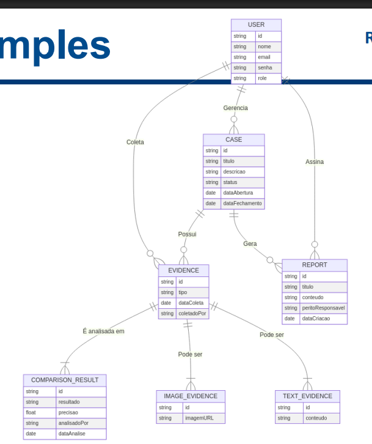

# Detalhes da 2 parte do projeto da disciplina (Back-end):

## Requisitos

### Necessário para segunda parte
- [x] Banco/ORM
- [x] Design de projeto e rotas
- [x] Boas práticas (http, segurança, código)
- [x] Swagger
- [x] Entidades integradas e funcionais
- [ ] Login/Autorização no app (Mesmos perfis e requisitos da aplicação web)
- [ ] Cadastro e consulta de Casos (Mesmos requisitos da aplicação web)
- [ ] Nova entidade: Vítima (NIC, Nome, Gênero, idade, Documento, Endereço, Cor/Etnia, Odontograma com anotação, anotação de regiões anatômicas )
- [ ] Todo Caso tem uma ou mais vítimas
- [ ] Cadastro de Evidências com Imagens e Geolocalização capturadas pelo aplicativo
- [ ] Geração de Laudos de Evidências e Relatórios de casos
- [ ] Dashboard / Banco de dados Odonto-Legal
- [ ] Nova entidade vítima
- [ ] Geração de Laudos e Relatórios com IA

### Gerenciamento de Casos Periciais
- [ ] Cadastro de novos casos odontolegais.
- [ ] Classificação por tipo (acidente, identificação de vítima, exame criminal etc.).
- [ ] Acompanhamento do status dos casos (em andamento, finalizado, arquivado).

### Upload e Análise de Evidências
- [ ] Envio de imagens de radiografias e odontogramas.
- [ ] Anotação e marcação em imagens odontológicas.
- [ ] Comparação de registros dentários utilizando algoritmos de IA.

### Geração de Laudos Periciais
- [ ] Modelos pré-definidos para padronização dos laudos.
- [ ] Inserção de descrições detalhadas e anexos.
- [ ] Geração automática de laudos em PDF.
- [ ] Assinatura digital dos peritos.

### Banco de Dados Odonto-Legal
- [ ] Registro de pacientes identificados e não identificados.
- [ ] Armazenamento de informações odontológicas relevantes.
- [ ] Mecanismo de busca para cruzamento de dados de vítimas e desaparecidos.

### Gestão de Usuários e Permissões
- [ ] Perfis de acesso (administrador, perito, assistente).
- [ ] Controle de permissões para visualização e edição de casos.
- [ ] Histórico de atividades e auditoria de ações no sistema.

### Integração e Exportação de Dados
- [ ] API para integração com sistemas forenses e de segurança pública.
- [ ] Exportação de relatórios e dados para instituições parceiras.

### Cadastro e Consulta de Casos Periciais
- [ ] Registro rápido de novos casos diretamente do campo.
- [ ] Consulta rápida a casos ativos e históricos.
- [ ] Atualização de informações periciais em tempo real.

### Captura e Análise de Imagens
- [ ] Captura de fotografias e radiografias com a câmera do dispositivo.
- [ ] Ajustes automáticos de qualidade de imagem para melhor análise.
- [ ] Envio direto das imagens para o Web App para posterior análise.

### Comparação de Registros Dentários
- [ ] Upload de imagens para análise automática via IA.
- [ ] Algoritmo de reconhecimento e comparação de padrões dentários.
- [ ] Sugestão automática de possíveis correspondências no banco de dados.

### Geração e Assinatura de Laudos Digitais
- [ ] Edição de laudos diretamente pelo aplicativo.
- [ ] Inserção de observações periciais em áudio ou texto.
- [ ] Assinatura digital para validação oficial.

### Consulta a Banco de Dados Odonto-Legal
- [ ] Busca rápida por registros dentários e perfis identificados.
- [ ] Verificação de dados de desaparecidos e vítimas não identificadas.
- [ ] Sincronização automática com o Web App para manter dados atualizados.

### Notificações e Alertas
- [ ] Alertas sobre atualizações em casos periciais.
- [ ] Notificações de laudos finalizados e documentos pendentes.
- [ ] Mensagens de atualização de novos registros no banco de dados.

# Requisitos Mínimos

## Autenticação e Gestão de Usuários
- [ ] Login e logout com autenticação segura
- [ ] Cadastro de novos usuários com diferentes perfis (Admin, Perito, Assistente)
- [ ] Gerenciamento de permissões (definir quem pode visualizar, editar ou excluir casos)

## Gerenciamento de Casos Periciais
- [ ] Cadastro de novos casos periciais, incluindo título, descrição e status
- [ ] Atualização do status do caso (Em andamento, Finalizado, Arquivado)
- [ ] Listagem e pesquisa de casos com filtros por data, status e responsável
- [ ] Visualização detalhada dos casos com informações completas

## Upload e Gestão de Evidências
- [ ] Upload de imagens odontológicas (radiografias, fotografias intraorais)
- [ ] Cadastro de evidências em texto (relatos, depoimentos, descrições técnicas)
- [ ] Organização das evidências por categoria e vinculação ao caso correspondente

## Geração de Laudos Periciais
- [ ] Criação de laudos periciais estruturados
- [ ] Inserção de informações detalhadas e anexos ao laudo
- [ ] Exportação do laudo em PDF com formatação profissional

## Banco de Dados Odonto-Legal
- [ ] Registro de pacientes identificados e não identificados
- [ ] Busca e comparação de registros dentários para identificação forense

## Autenticação e Acesso
- [ ] Login e logout com autenticação segura
- [ ] Controle de permissões para diferentes tipos de usuários

## Cadastro e Consulta de Casos Periciais
- [ ] Listagem de casos ativos e finalizados
- [ ] Registro de novos casos diretamente pelo aplicativo
- [ ] Consulta rápida de informações e status dos casos

## Captura e Upload de Evidências
- [ ] Captura de imagens odontológicas diretamente pela câmera do celular
- [ ] Upload seguro de evidências para vinculação ao caso
- [ ] Ferramenta de anotações sobre as evidências coletadas

## Análise e Comparação de Registros
- [ ] Envio de imagens para análise automática via IA
- [ ] Exibição de resultados de comparação e alertas sobre similaridades

## Geração e Consulta de Laudos
- [ ] Acesso a laudos periciais diretamente pelo app
- [ ] Inserção de observações periciais em áudio ou texto

